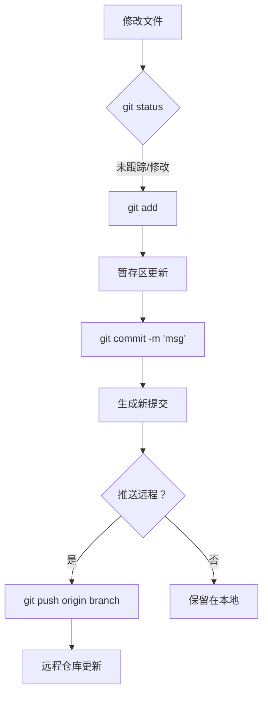

# 基础提交流程

## 命令速查

| 步骤 | 命令 | 说明 |
|------|------|------|
| 查看状态 | `git status` | 检查哪些文件被修改 |
| 暂存文件 | `git add <file>` | 将文件加入暂存区 |
| 提交更改 | `git commit -m 'message'` | 创建新提交 |
| 推送到远程 | `git push origin <branch>` | 将提交推送到远程仓库 |

## 使用场景

- 日常开发提交
- 个人项目维护
- 单分支简单协作

## 使用频率：⭐⭐⭐⭐⭐
