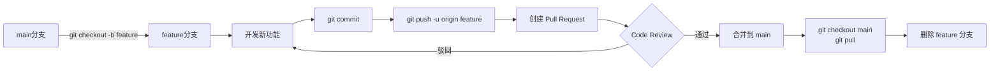

# 分支协作流程

## 命令速查

| 步骤 | 命令 | 说明 |
|------|------|------|
| 创建特性分支 | `git checkout -b feature/name` | 从 main 创建新分支 |
| 推送分支 | `git push -u origin feature/name` | 首次推送并关联 |
| 切换回 main | `git checkout main` | 回到主分支 |
| 拉取更新 | `git pull` | 获取最新代码 |
| 删除分支 | `git branch -d feature/name` | 合并后删除本地分支 |

## 使用场景

- 团队协作开发
- 特性隔离开发
- Code Review 工作流

## 使用频率：⭐⭐⭐⭐⭐
