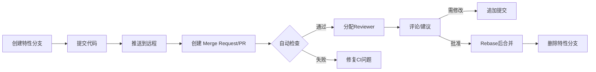

# 代码审查工作流

## 流程说明

1. **创建特性分支** - 从 main 创建独立分支
2. **提交代码** - 小步提交，清晰 commit message
3. **推送到远程** - 使代码可被审查
4. **创建 PR/MR** - 在 GitHub/GitLab 创建合并请求
5. **自动化检查** - CI 运行测试、代码风格检查
6. **人工审查** - Reviewer 审查代码质量
7. **修改或合并** - 根据反馈修改或直接合并

## PR 最佳实践

- **小而美** - 单个 PR 只做一件事
- **清晰描述** - 说明改动原因和影响
- **关联 Issue** - 关联相关的 issue 或需求
- **及时响应** - 及时回复 reviewer 的评论

## 使用场景

- 团队协作开发
- 开源项目贡献
- 代码质量控制

## 使用频率：⭐⭐⭐⭐⭐
