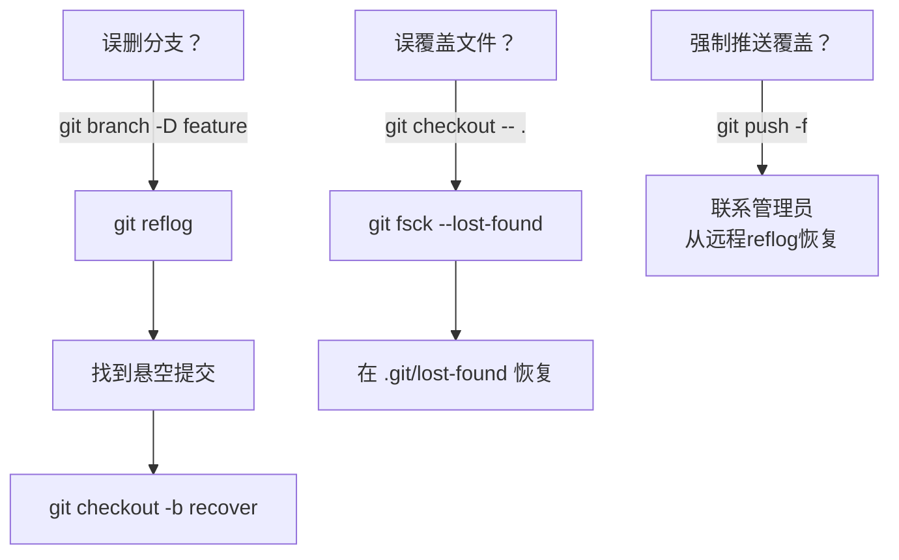

# 灾难恢复流程



## 恢复命令速查

| 灾难场景 | 恢复命令 | 说明 |
|----------|----------|------|
| 误删分支 | `git reflog` | 查看所有操作历史 |
| 恢复分支 | `git checkout -b recover <commit-id>` | 从 reflog 的提交恢复 |
| 误覆盖文件 | `git fsck --lost-found` | 查找悬空对象 |
| 强制推送后 | 联系管理员 | 远程服务器可能有 reflog |

## reflog 常用命令

```bash
# 查看完整 reflog
git reflog

# 查看特定分支的 reflog
git reflog show main

# 恢复到指定时间点
git reset --hard HEAD@{2}
```

## ⚠️ 重要提醒

- **reflog 只保留 90 天**（默认设置）
- **定期 push 到远程**是最有效的备份
- **强制推送前务必确认**

## 预防措施

- 开启分支保护规则
- 禁止向 main 强制推送
- 定期备份重要分支

## 使用场景

- 误删重要分支
- 误用 `--hard` 重置
- 强制推送覆盖了他人代码

## 使用频率：⭐（希望如此）
