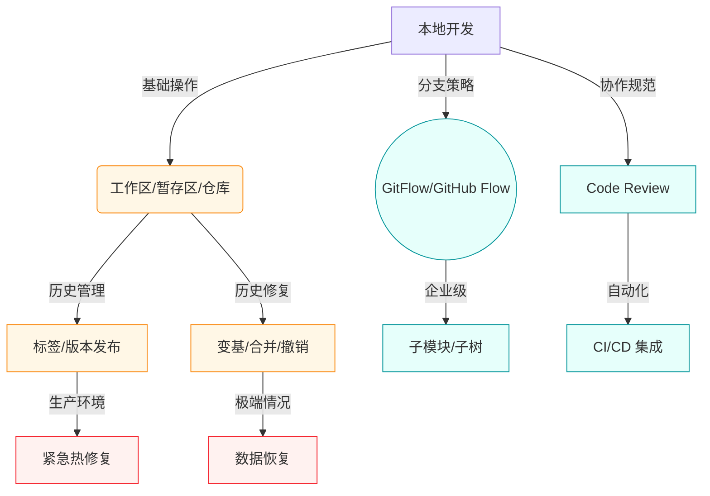

# Git 全流程全景图

## 工作流分类

### 核心操作（橙色）
- **工作区/暂存区/仓库** - 基础概念理解
- **标签/版本发布** - 版本管理
- **变基/合并/撤销** - 历史操作

### 协作规范（青色）
- **GitFlow/GitHub Flow** - 分支策略
- **Code Review** - 代码审查
- **子模块/子树** - 多仓库管理
- **CI/CD 集成** - 自动化

### 应急响应（红色）
- **紧急热修复** - 生产环境问题
- **数据恢复** - 灾难恢复

## 关键概念速查

| **区域**   | **作用**     | **核心命令**                            |
| -------- | ---------- | ----------------------------------- |
| **工作区**  | 实际文件操作目录   | `git status`, `git diff`            |
| **暂存区**  | 下次提交的预演区   | `git add`, `git reset HEAD`         |
| **本地仓库** | 存储完整历史记录   | `git commit`, `git log`             |
| **远程仓库** | 团队协作中心     | `git push`, `git fetch`, `git pull` |
| **分支指针** | 提交历史的轻量级指针 | `git branch`, `git checkout`        |
