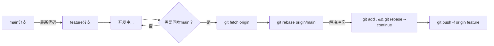

# 变基协作流程

## 命令速查

| 步骤 | 命令 | 说明 |
|------|------|------|
| 获取最新 | `git fetch origin` | 下载远程更新 |
| 执行变基 | `git rebase origin/main` | 将当前分支变基到最新 main |
| 解决冲突后继续 | `git rebase --continue` | 冲突解决后继续变基 |
| 中止变基 | `git rebase --abort` | 放弃变基，回到之前状态 |
| 强制推送 | `git push -f origin feature` | 重写历史后需要强制推送 |

## ⚠️ 重要提醒

- **不要在共享分支上使用 `rebase`**
- 强制推送 `-f` 会重写远程历史，仅在个人特性分支使用

## Rebase vs Merge

| 方式 | 优点 | 缺点 |
|------|------|------|
| Rebase | 线性历史，清晰 | 改写历史，风险高 |
| Merge | 保留历史，安全 | 历史可能复杂 |

## 使用场景

- 个人特性分支整理
- 提交前保持与主分支同步
- 清理提交历史

## 使用频率：⭐⭐⭐
