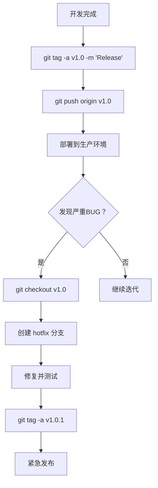

# 版本发布与标签管理

## 命令速查

| 操作 | 命令 | 说明 |
|------|------|------|
| 创建标签 | `git tag -a v1.0 -m 'Release'` | 创建带注释的标签 |
| 推送标签 | `git push origin v1.0` | 推送单个标签 |
| 推送所有标签 | `git push origin --tags` | 推送所有本地标签 |
| 检出标签 | `git checkout v1.0` | 切换到标签状态 |
| 基于标签创建分支 | `git checkout -b hotfix v1.0` | 从标签创建热修复分支 |

## 语义化版本

- **v1.0.0** - 主版本（重大变更）
- **v1.1.0** - 次版本（新功能）
- **v1.0.1** - 补丁版本（Bug 修复）

## 使用场景

- 软件版本发布
- 生产环境部署
- 紧急 Bug 修复

## 使用频率：⭐⭐⭐⭐
