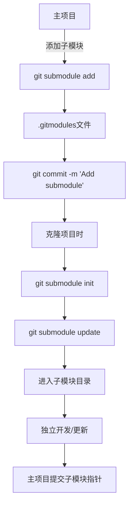

# 子模块管理流程

## 命令速查

| 操作 | 命令 | 说明 |
|------|------|------|
| 添加子模块 | `git submodule add <repo-url>` | 添加外部仓库为子模块 |
| 初始化子模块 | `git submodule init` | 初始化本地配置文件 |
| 更新子模块 | `git submodule update` | 拉取子模块代码 |
| 克隆包含子模块 | `git clone --recurse-submodules <repo>` | 递归克隆所有子模块 |
| 更新所有子模块 | `git submodule update --remote` | 拉取子模块最新代码 |

## 子模块 vs 子树

| 特性 | 子模块 | 子树 |
|------|--------|------|
| 复杂度 | 较高 | 较低 |
| 独立性 | 强 | 弱 |
| 适用场景 | 独立维护的外部库 | 内部共享代码 |

## 使用场景

- 大型项目拆分
- 依赖第三方库
- 多仓库协同

## 使用频率：⭐⭐
