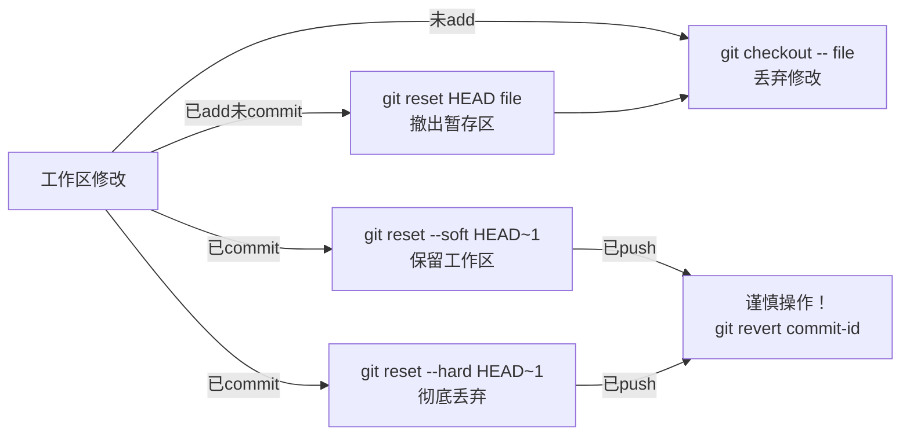

# 撤销操作流程

## 命令速查

| 场景 | 命令 | 效果 |
|------|------|------|
| 未暂存的修改 | `git checkout -- <file>` | 丢弃工作区修改 |
| 已暂存未提交 | `git reset HEAD <file>` | 撤出暂存区，保留修改 |
| 撤销最近提交（保留修改）| `git reset --soft HEAD~1` | 撤销提交，修改保留在暂存区 |
| 撤销最近提交（丢弃修改）| `git reset --hard HEAD~1` | 彻底删除提交和修改 |
| 已推送的提交 | `git revert <commit-id>` | 创建反向提交，保留历史 |

## ⚠️ 重要提醒

- `--hard` 会永久删除修改，谨慎使用！
- 已 push 的提交尽量用 `revert`，避免重写历史

## 使用场景

- 误操作恢复
- 代码回退
- 提交前清理

## 使用频率：⭐⭐⭐⭐
