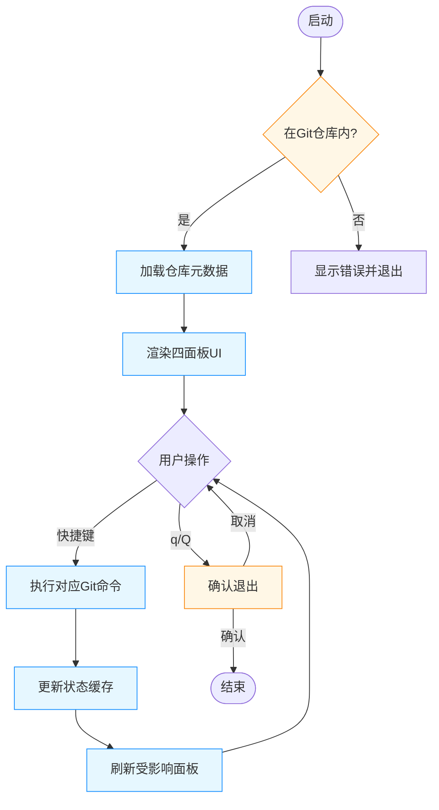

# 基本工作流程图

```mermaid
flowchart TD
    A([启动]) --> B{在Git仓库内?}
    B -->|是| C[加载仓库元数据]
    B -->|否| D[显示错误并退出]
    C --> E[渲染四面板UI]
    E --> F{用户操作}
    F -->|快捷键| G[执行对应Git命令]
    G --> H[更新状态缓存]
    H --> I[刷新受影响面板]
    I --> F
    F -->|q/Q| J[确认退出]
    J -->|确认| K([结束])
    J -->|取消| F
    
    classDef decision fill:#fff7e6,stroke:#fa8c16;
    classDef process fill:#e6f7ff,stroke:#1890ff;
    class B,J decision;
    class C,E,G,H,I process;
```

## 流程说明

1. **启动检查** - 确认是否在 Git 仓库内
2. **加载元数据** - 读取仓库状态、分支信息等
3. **渲染 UI** - 显示四面板界面
4. **事件循环** - 等待用户输入，执行对应操作
5. **状态更新** - 执行后刷新相关面板
6. **退出确认** - 按 `q` 确认退出
