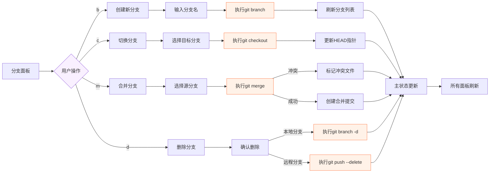

# 分支管理流程图

```mermaid
flowchart LR
    A[分支面板] --> B{用户操作}
    B -->|b| C[创建新分支]
    B -->|c| D[切换分支]
    B -->|m| E[合并分支]
    B -->|d| F[删除分支]
    
    C --> C1[输入分支名]
    C1 --> C2[执行git branch]
    C2 --> C3[刷新分支列表]
    
    D --> D1[选择目标分支]
    D1 --> D2[执行git checkout]
    D2 --> D3[更新HEAD指针]
    
    E --> E1[选择源分支]
    E1 --> E2[执行git merge]
    E2 -->|冲突| E3[标记冲突文件]
    E2 -->|成功| E4[创建合并提交]
    
    F --> F1[确认删除]
    F1 -->|本地分支| F2[执行git branch -d]
    F1 -->|远程分支| F3[执行git push --delete]
    
    C3 & D3 & E3 & E4 & F2 & F3 --> G[主状态更新]
    G --> H[所有面板刷新]
    
    classDef action fill:#f9f0ff,stroke:#722ed1;
    classDef cmd fill:#fff2e8,stroke:#ff7a45;
    class B action;
    class C2,D2,E2,F2,F3 cmd;
```

## 快捷键对照

| 按键 | 操作 |
|------|------|
| `b` | 创建新分支 |
| `c` | 切换分支 |
| `m` | 合并分支 |
| `d` | 删除分支 |
