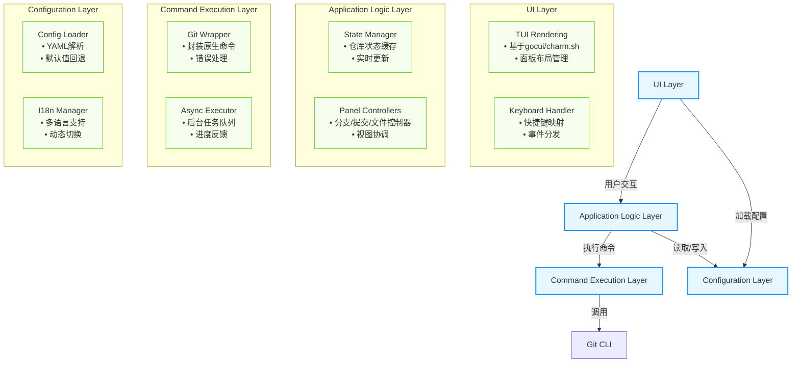

# Lazygit 核心架构图

## 架构层次说明

| 层次 | 职责 |
|------|------|
| **UI Layer** | TUI 渲染、键盘事件处理 |
| **Application Logic Layer** | 状态管理、面板控制器 |
| **Command Execution Layer** | Git 命令封装、异步执行 |
| **Configuration Layer** | 配置加载、国际化 |
