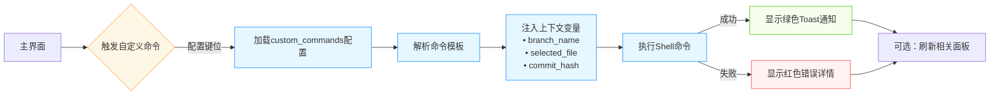

# 高级自定义命令流程



## 配置示例

在 `~/.config/lazygit/config.yml` 中添加：

```yaml
customCommands:
  - key: '<c-p>'
    command: 'git push origin {{.CurrentBranch}}'
    context: 'branches'
    description: 'Push to origin'
```

## 可用上下文变量

| 变量 | 说明 |
|------|------|
| `{{.CurrentBranch}}` | 当前分支名 |
| `{{.SelectedFile}}` | 选中的文件 |
| `{{.SelectedCommit}}` | 选中的提交哈希 |
