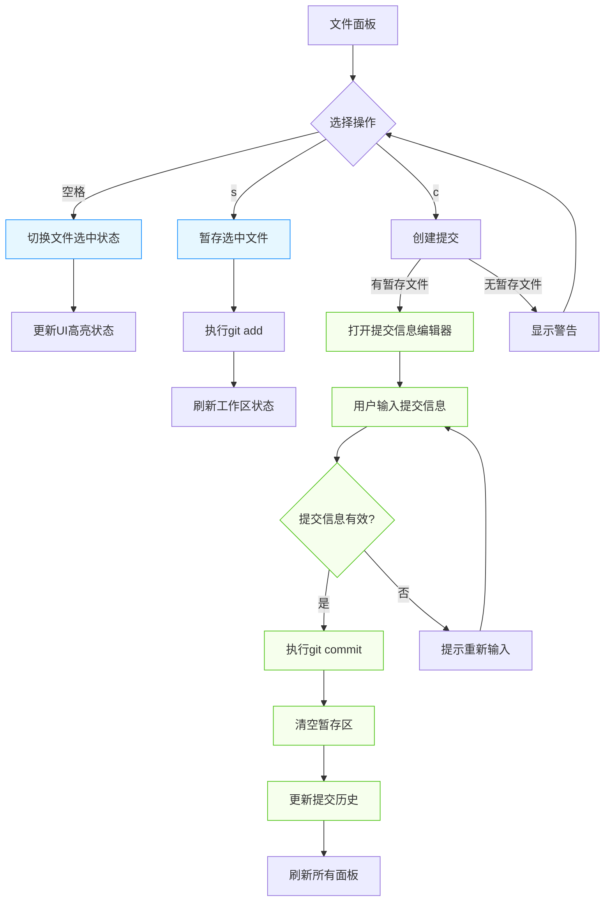

# 文件提交流程图

```mermaid
flowchart TB
    A[文件面板] --> B{选择操作}
    B -->|空格| C[切换文件选中状态]
    B -->|s| D[暂存选中文件]
    B -->|c| E[创建提交]
    
    C --> F[更新UI高亮状态]
    D --> G[执行git add]
    G --> H[刷新工作区状态]
    
    E -->|有暂存文件| I[打开提交信息编辑器]
    E -->|无暂存文件| J[显示警告]
    J --> B
    
    I --> K[用户输入提交信息]
    K --> L{提交信息有效?}
    L -->|是| M[执行git commit]
    L -->|否| N[提示重新输入]
    N --> K
    
    M --> O[清空暂存区]
    O --> P[更新提交历史]
    P --> Q[刷新所有面板]
    
    classDef selection fill:#e6f7ff,stroke:#1890ff;
    classDef commit fill:#f6ffed,stroke:#52c41a;
    class C,D selection;
    class I,K,L,M,O,P commit;
```

## 快捷键对照

| 按键 | 操作 |
|------|------|
| `Space` | 切换文件选中状态 |
| `s` | 暂存选中文件 |
| `c` | 创建提交 |
