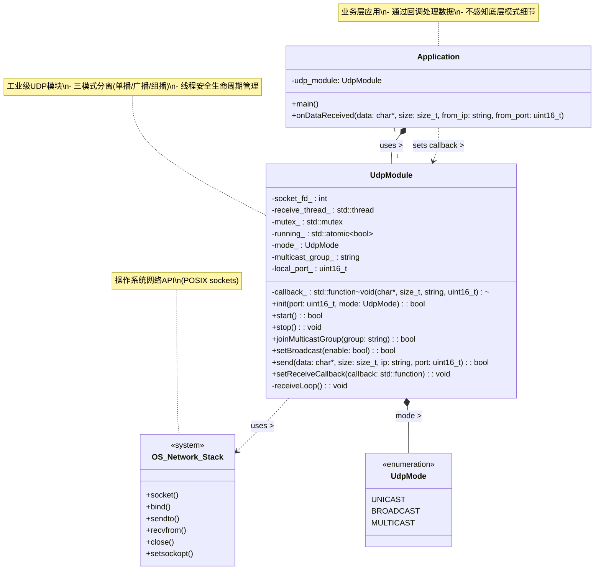
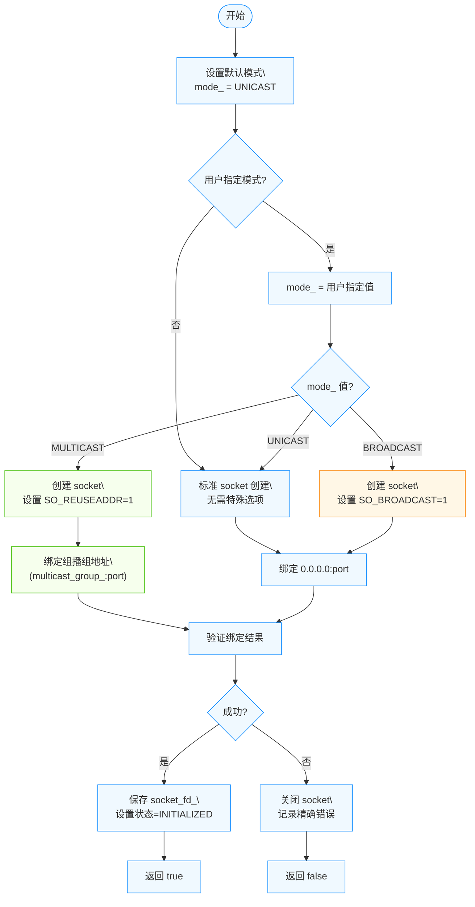
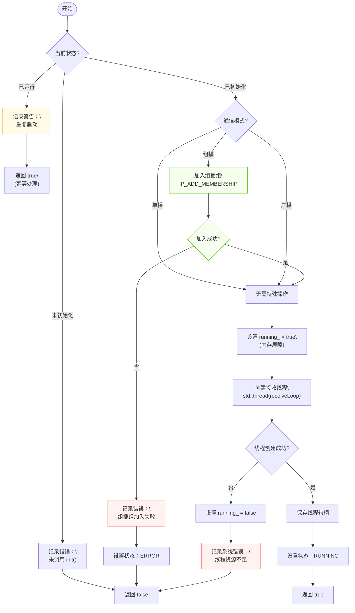
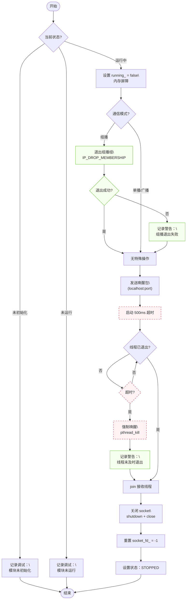
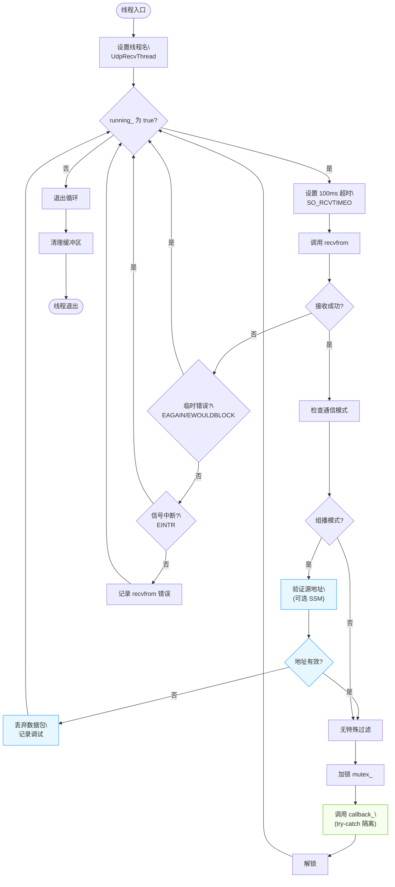
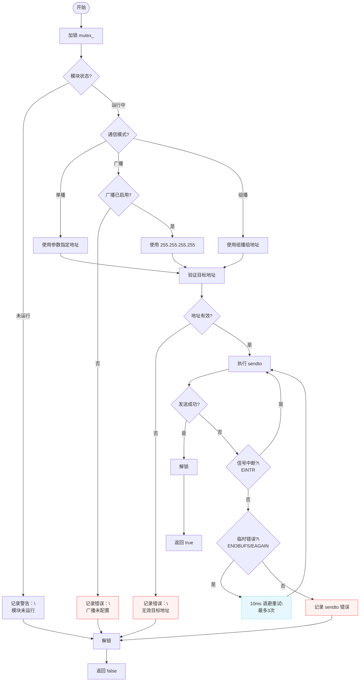

# c++ udp模块

## 架构图

```mermaid
classDiagram
    class UdpModule {
        -socket_fd_ : int
        -receive_thread_ : std::thread
        -mutex_ : std::mutex
        -callback_ : std::function~void(char*, size_t, string, uint16_t)~
        -running_ : std::atomic~bool~
        -mode_ : UdpMode
        -multicast_group_ : string
        -local_port_ : uint16_t

        +init(port: uint16_t, mode: UdpMode) : bool
        +start() : bool
        +stop() : void
        +joinMulticastGroup(group: string) : bool
        +setBroadcast(enable: bool) : bool
        +send(data: char*, size: size_t, ip: string, port: uint16_t) : bool
        +setReceiveCallback(callback: std::function) : void
        -receiveLoop() : void
    }

    class UdpMode {
        <<enumeration>>
        UNICAST
        BROADCAST
        MULTICAST
    }

    class Application {
        -udp_module: UdpModule
        +main()
        +onDataReceived(data: char*, size: size_t, from_ip: string, from_port: uint16_t)
    }

    class OS_Network_Stack {
        <<system>>
        +socket()
        +bind()
        +sendto()
        +recvfrom()
        +close()
        +setsockopt()
    }

    Application "1" *-- "1" UdpModule : uses >
    UdpModule ..> OS_Network_Stack : uses >
    UdpModule *-- UdpMode : mode >
    Application ..> UdpModule : sets callback >

    note for UdpModule "工业级UDP模块\\n- 三模式分离(单播/广播/组播)\\n- 线程安全生命周期管理"
    note for Application "业务层应用\\n- 通过回调处理数据\\n- 不感知底层模式细节"
    note for OS_Network_Stack "操作系统网络API\\n(POSIX sockets)"
```

## 流程图

### 1. 初始化流程

```mermaid
flowchart TD
    A([开始]) --> B["设置默认模式\\nmode_ = UNICAST"]
    B --> C{"用户指定模式?"}
    C -- 是 --> D["mode_ = 用户指定值"]
    C -- 否 --> E[...继续默认单播初始化...]
    D --> F{"mode_ 值?"}
    F -- UNICAST --> E["标准 socket 创建\\n无需特殊选项"]
    F -- BROADCAST --> G["创建 socket\\n设置 SO_BROADCAST=1"]
    F -- MULTICAST --> H["创建 socket\\n设置 SO_REUSEADDR=1"]
    E --> I["绑定 0.0.0.0:port"]
    G --> I
    H --> J["绑定组播组地址\\n(multicast_group_:port)"]
    J --> K[...后续验证...]
    I --> K["验证绑定结果"]
    K --> L{"成功?"}
    L -- 是 --> M["保存 socket_fd_\\n设置状态=INITIALIZED"]
    L -- 否 --> N["关闭 socket\\n记录精确错误"]
    N --> O["返回 false"]
    M --> P["返回 true"]
    
    classDef default fill:#f0f9ff,stroke:#1890ff
    classDef broadcast fill:#fff7e6,stroke:#fa8c16
    classDef multicast fill:#f6ffed,stroke:#52c41a
    class E,I default
    class G broadcast
    class H,J multicast
```

### 2. 启动流程

```mermaid
flowchart TD
    A([开始]) --> B{"当前状态?"}
    B -- 未初始化 --> C["记录错误：\\n未调用 init()"]
    C --> D["返回 false"]
    B -- 已运行 --> E["记录警告：\\n重复启动"]
    E --> F["返回 true\\n(幂等处理)"]
    B -- 已初始化 --> G{"通信模式?"}
    G -- 单播 --> H["无需特殊操作"]
    G -- 广播 --> H
    G -- 组播 --> I["加入组播组\\nIP_ADD_MEMBERSHIP"]
    I --> J{"加入成功?"}
    J -- 否 --> K["记录错误：\\n组播组加入失败"]
    K --> L["设置状态：ERROR"]
    L --> D
    J -- 是 --> H
    H --> M["设置 running_ = true\\n(内存屏障)"]
    M --> N["创建接收线程\\nstd::thread(receiveLoop)"]
    N --> O{"线程创建成功?"}
    O -- 否 --> P["设置 running_ = false"]
    P --> Q["记录系统错误：\\n线程资源不足"]
    Q --> D
    O -- 是 --> R["保存线程句柄"]
    R --> S["设置状态：RUNNING"]
    S --> T["返回 true"]
    
    classDef error fill:#fff2f0,stroke:#ff4d4f
    classDef warning fill:#fffbe6,stroke:#faad14
    classDef multicast fill:#f6ffed,stroke:#52c41a
    class K,Q error
    class E warning
    class I,J multicast
```

### 3. 停止流程

```mermaid
flowchart TD
    A([开始]) --> B{"当前状态?"}
    B -- 未初始化 --> C["记录调试：\\n模块未初始化"]
    C --> D([结束])
    B -- 未运行 --> E["记录调试：\\n模块未运行"]
    E --> D
    B -- 运行中 --> F["设置 running_ = false\\n内存屏障"]
    F --> G{"通信模式?"}
    G -- 组播 --> H["退出组播组\\nIP_DROP_MEMBERSHIP"]
    H --> I{"退出成功?"}
    I -- 否 --> J["记录警告：\\n组播退出失败"]
    I -- 是 --> K
    G -- 单播/广播 --> K["无特殊操作"]
    J --> K
    K --> L["发送唤醒包\\n(localhost:port)"]
    L --> M["启动 500ms 超时"]
    M --> N{"线程已退出?"}
    N -- 否 --> O{"超时?"}
    O -- 是 --> P["强制唤醒\\npthread_kill"]
    P --> Q["记录警告：\\n线程未及时退出"]
    Q --> R
    O -- 否 --> N
    N -- 是 --> R["join 接收线程"]
    R --> S["关闭 socket\\nshutdown + close"]
    S --> T["重置 socket_fd_ = -1"]
    T --> U["设置状态：STOPPED"]
    U --> D
    
    classDef multicast fill:#f6ffed,stroke:#52c41a
    classDef timeout fill:#fff2f5,stroke:#cf1322,stroke-dasharray:5 5
    class H,I,J,P,Q multicast
    class M,O,P timeout
```

### 4. 接收循环流程

```mermaid
flowchart TD
    A([线程入口]) --> B["设置线程名\\nUdpRecvThread"]
    B --> C{"running_ 为 true?"}
    C -- 否 --> D["退出循环"]
    C -- 是 --> E["设置 100ms 超时\\nSO_RCVTIMEO"]
    E --> F["调用 recvfrom"]
    F --> G{"接收成功?"}
    G -- 是 --> H["检查通信模式"]
    H --> I{"组播模式?"}
    I -- 是 --> J["验证源地址\\n(可选 SSM)"]
    J --> K{"地址有效?"}
    K -- 否 --> L["丢弃数据包\\n记录调试"]
    K -- 是 --> M
    I -- 否 --> M["无特殊过滤"]
    L --> C
    M --> N["加锁 mutex_"]
    N --> O["调用 callback_\\n(try-catch 隔离)"]
    O --> P["解锁"]
    P --> C
    G -- 否 --> Q{"临时错误?\\nEAGAIN/EWOULDBLOCK"}
    Q -- 是 --> C
    Q -- 否 --> R{"信号中断?\\nEINTR"}
    R -- 是 --> C
    R -- 否 --> S["记录 recvfrom 错误"]
    S --> C
    D --> T["清理缓冲区"]
    T --> U([线程退出])
    
    classDef filter fill:#e6f7ff,stroke:#1890ff
    classDef callback fill:#f6ffed,stroke:#52c41a
    class J,K,L filter
    class O callback
```

### 5. 发送流程

```mermaid
flowchart TD
    A([开始]) --> B["加锁 mutex_"]
    B --> C{"模块状态?"}
    C -- 未运行 --> D["记录警告：\\n模块未运行"]
    D --> E["解锁"]
    E --> F["返回 false"]
    C -- 运行中 --> G{"通信模式?"}
    G -- 单播 --> H["使用参数指定地址"]
    G -- 广播 --> I{"广播已启用?"}
    I -- 否 --> J["记录错误：\\n广播未配置"]
    J --> E
    I -- 是 --> K["使用 255.255.255.255"]
    G -- 组播 --> L["使用组播组地址"]
    H & K & L --> M["验证目标地址"]
    M --> N{"地址有效?"}
    N -- 否 --> O["记录错误：\\n无效目标地址"]
    O --> E
    N -- 是 --> P["执行 sendto"]
    P --> Q{"发送成功?"}
    Q -- 是 --> R["解锁"]
    R --> S["返回 true"]
    Q -- 否 --> T{"信号中断?\\nEINTR"}
    T -- 是 --> P
    T -- 否 --> U{"临时错误?\\nENOBUFS/EAGAIN"}
    U -- 是 --> V["10ms 退避重试\\n最多3次"]
    V --> P
    U -- 否 --> W["记录 sendto 错误"]
    W --> E
    
    classDef retry fill:#e6f7ff,stroke:#13c2c2,stroke-dasharray:3 3
    classDef error fill:#fff2f0,stroke:#ff4d4f
    class J,O,W error
    class V retry
```
