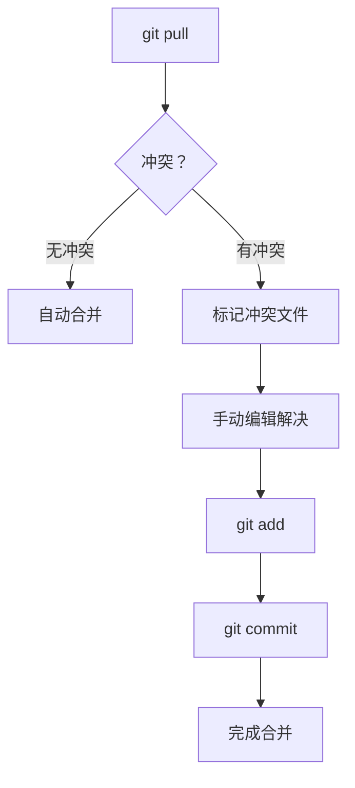

# 冲突解决流程



## 命令速查

| 步骤 | 命令 | 说明 |
|------|------|------|
| 查看冲突 | `git status` | 显示冲突文件列表 |
| 标记已解决 | `git add <file>` | 将解决后的文件标记为已解决 |
| 完成合并 | `git commit` | 提交合并结果 |
| 中止合并 | `git merge --abort` | 放弃当前合并 |

## 冲突标记格式

```
<<<<<<< HEAD
当前分支的代码
=======
合并分支的代码
>>>>>>> branch-name
```

## 解决技巧

- 不确定时与对方开发者沟通
- 复杂冲突使用 `git mergetool`
- 解决后务必测试
- 偏好 rebase 获取更整洁历史（仅限个人分支）

## 使用场景

- 多人修改同一文件
- 长时间未同步分支
- 合并或变基时

## 使用频率：⭐⭐⭐⭐
