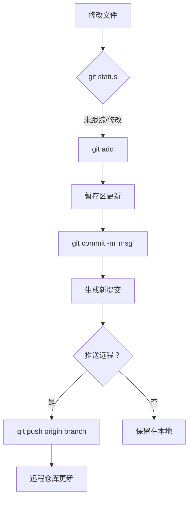
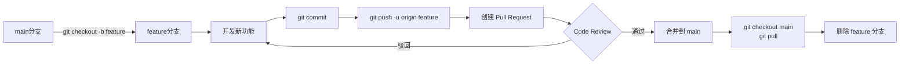
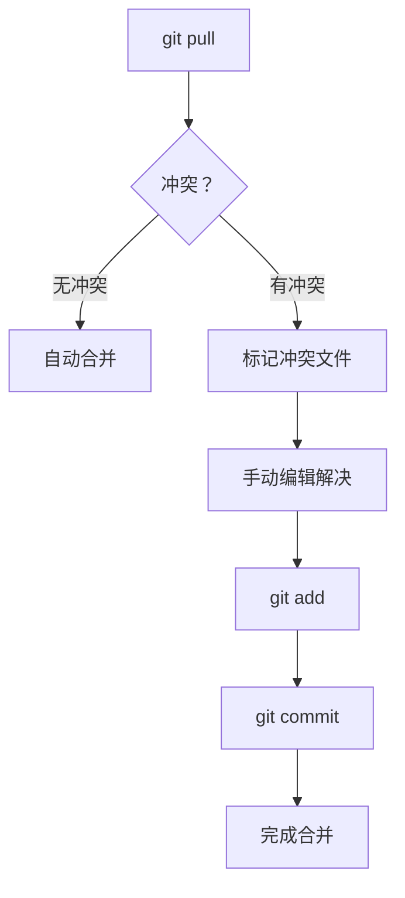
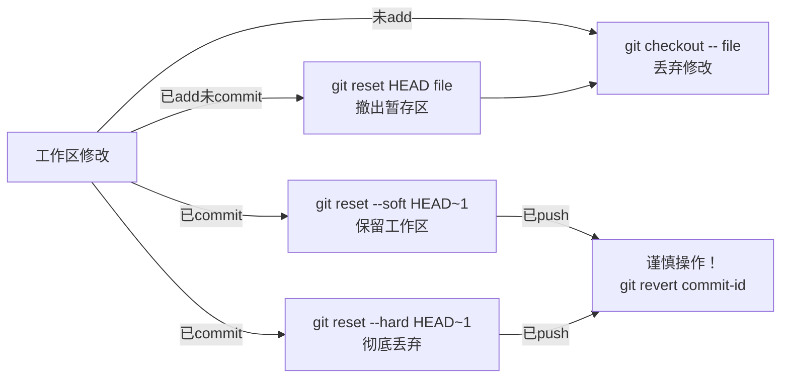

### 基础提交流程

```mermaid
flowchart TD
    A[修改文件] --> B{git status}
    B -->|未跟踪/修改| C[git add <file>]
    C --> D[暂存区更新]
    D --> E[git commit -m 'msg']
    E --> F[生成新提交]
    F --> G{推送远程？}
    G -->|是| H[git push origin branch]
    G -->|否| I[保留在本地]
    H --> J[远程仓库更新]
```

### 分支协作流程

```mermaid
flowchart LR
    A[main分支] -->|git checkout -b feature| B[feature分支]
    B --> C[开发新功能]
    C --> D[git commit]
    D --> E[git push -u origin feature]
    E --> F[创建 Pull Request]
    F --> G{Code Review}
    G -->|通过| H[合并到 main]
    G -->|驳回| C
    H --> I[git checkout main<br/>git pull]
    I --> J[删除 feature 分支]
```

### 3. 冲突解决流程

```mermaid
flowchart TB
    A[git pull] --> B{冲突？}
    B -->|无冲突| C[自动合并]
    B -->|有冲突| D[标记冲突文件]
    D --> E[手动编辑解决]
    E --> F[git add <resolved-file>]
    F --> G[git commit]
    G --> H[完成合并]
```

### 4. 撤销操作流程

```mermaid
flowchart LR
    A[工作区修改] -->|未add| B[git checkout -- file<br/>丢弃修改]
    A -->|已add未commit| C[git reset HEAD file<br/>撤出暂存区]
    C --> B
    A -->|已commit| D[git reset --soft HEAD~1<br/>保留工作区]
    A -->|已commit| E[git reset --hard HEAD~1<br/>彻底丢弃]
    D & E -->|已push| F[谨慎操作！<br/>git revert commit-id]
```
