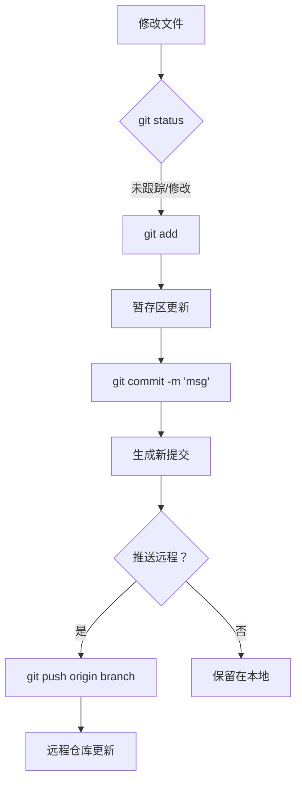
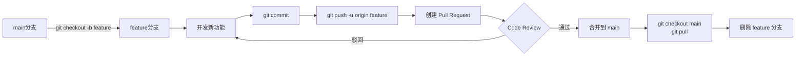
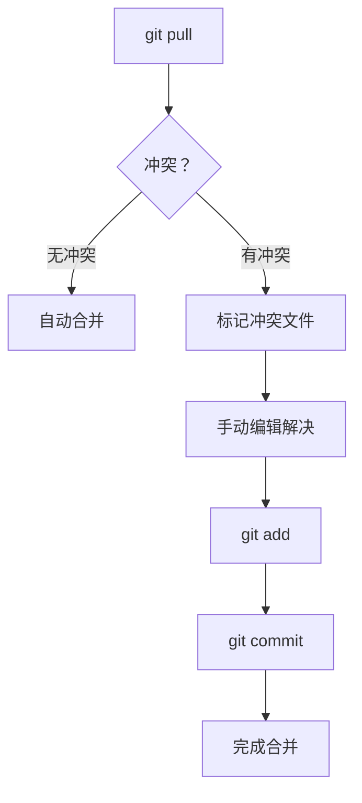
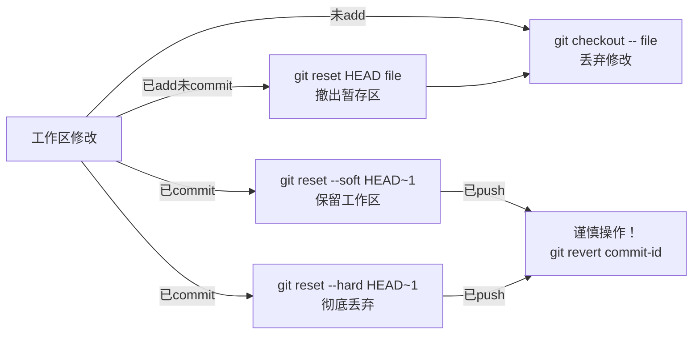
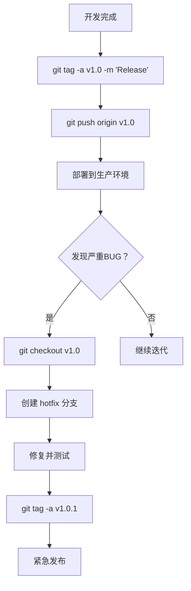
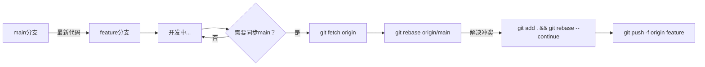
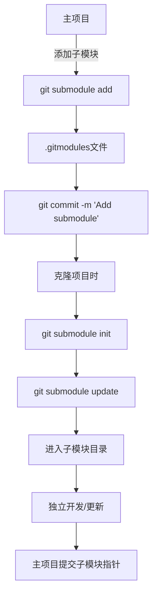
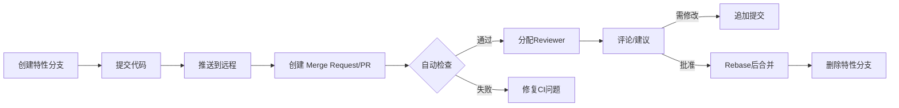
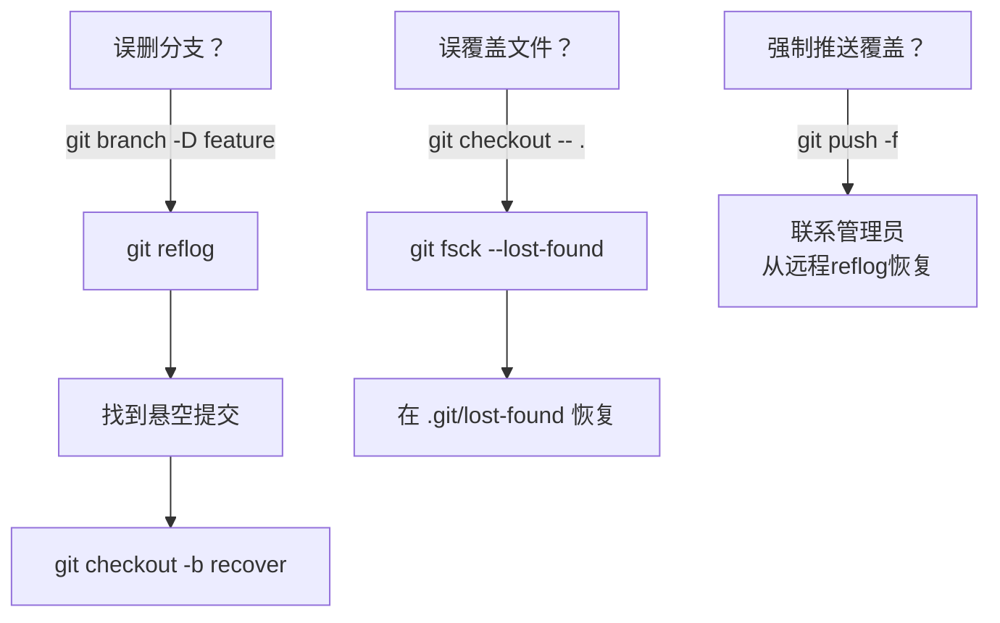
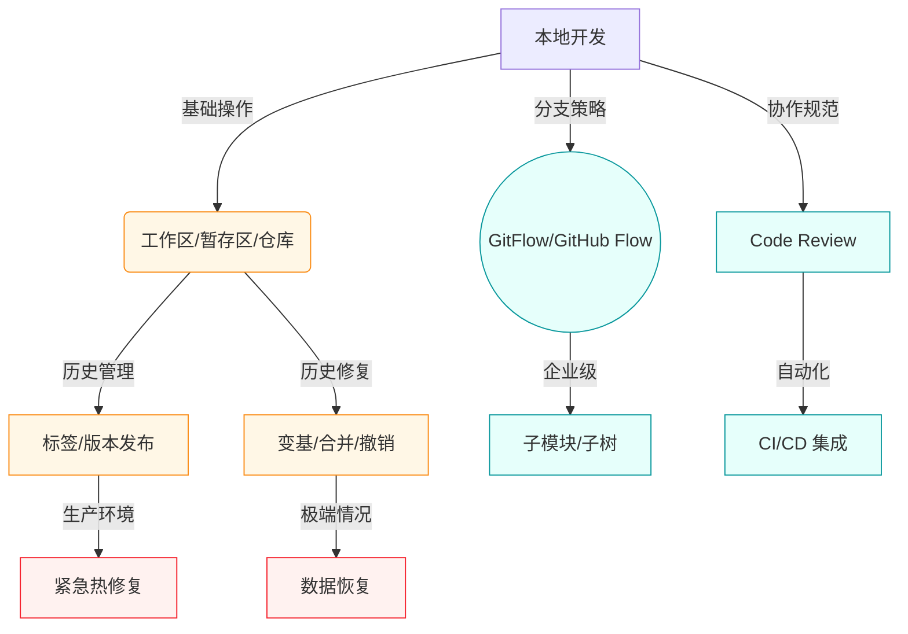

	### 基础提交流程

### 分支协作流程

### 3. 冲突解决流程

### 4. 撤销操作流程

#### 5. 版本回退与发布流程（标签管理）

#### 6. 变基协作流程（保持提交历史整洁）

#### 7. 子模块管理流程（大型项目依赖）

#### 8. 代码审查工作流（现代团队标准）

#### 9. 灾难恢复流程（误操作急救）

---

### 四、Git 全流程全景图

### 五、关键场景速查表
| **场景类型**       | **适用流程图**         | **核心命令/工具**                     | **使用频率** |
|--------------------|-----------------------|---------------------------------------|------------|
| 日常提交           | 基础提交流程 (1)      | `git add -p`, `git commit --amend`    | ⭐⭐⭐⭐⭐      |
| 团队协作           | 分支协作 (2) + 代码审查 (8) | `git rebase`, GitHub PR/MR           | ⭐⭐⭐⭐⭐      |
| 历史修复           | 撤销操作 (4) + 灾难恢复 (9) | `git revert`, `git reflog`           | ⭐⭐⭐⭐       |
| 版本发布           | 标签管理 (5)          | `git tag --sign`, `git push --tags`   | ⭐⭐⭐⭐       |
| 多仓库管理         | 子模块流程 (7)        | `git submodule update --remote`       | ⭐⭐         |
| 历史重写           | 变基流程 (6)          | `git rebase -i`, `git filter-repo`    | ⭐⭐⭐        |
| 紧急修复           | 热修复子流程 (5)      | `git checkout v1.0 -b hotfix`         | ⭐⭐⭐        |

### 三、关键概念速查表
| **区域**   | **作用**     | **核心命令**                            |
| -------- | ---------- | ----------------------------------- |
| **工作区**  | 实际文件操作目录   | `git status`, `git diff`            |
| **暂存区**  | 下次提交的预演区   | `git add`, `git reset HEAD`         |
| **本地仓库** | 存储完整历史记录   | `git commit`, `git log`             |
| **远程仓库** | 团队协作中心     | `git push`, `git fetch`, `git pull` |
| **分支指针** | 提交历史的轻量级指针 | `git branch`, `git checkout`        |
