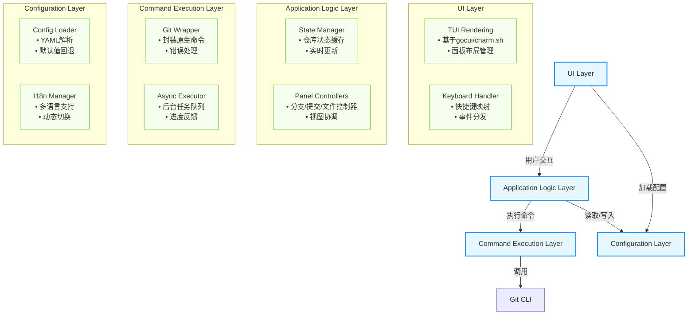
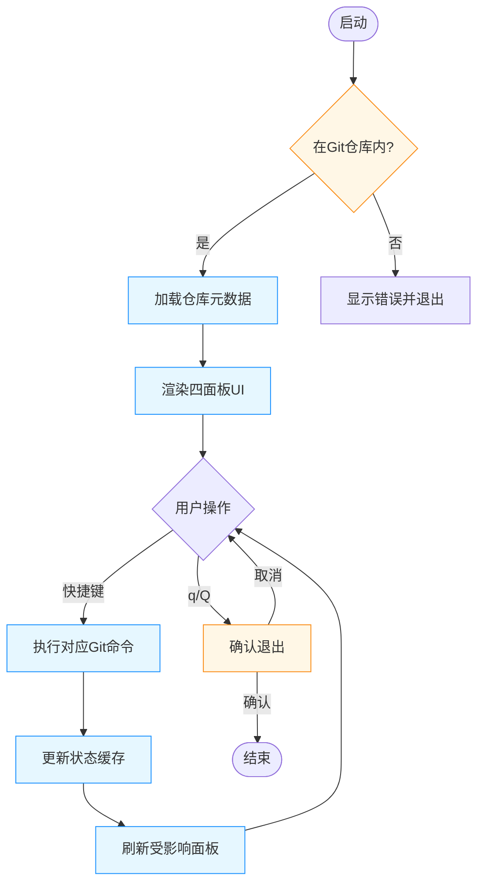
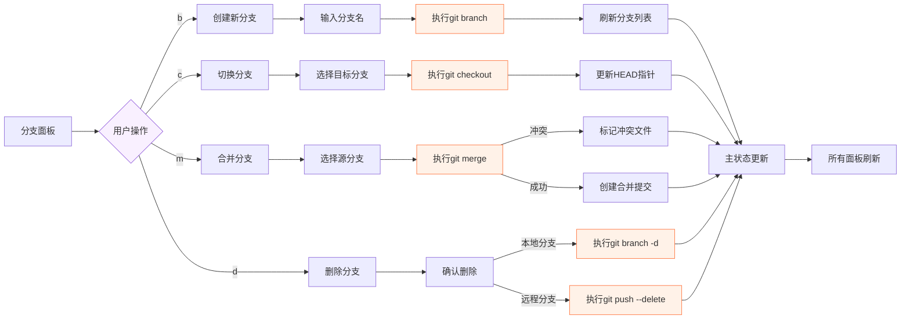
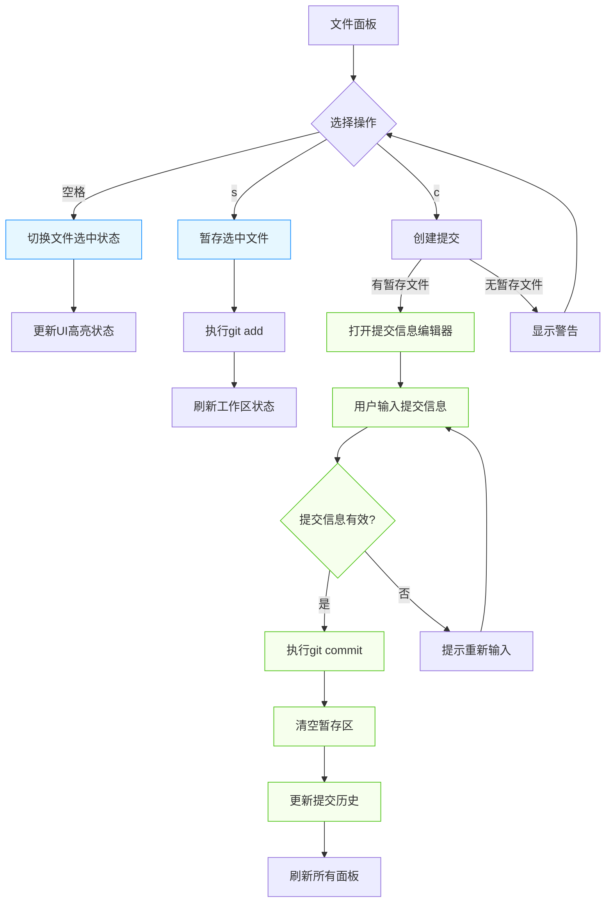
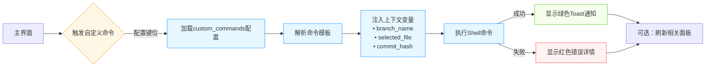

---
url:
---
### 1. Lazygit 核心架构图

```mermaid
graph TD
    A[UI Layer] -->|用户交互| B[Application Logic Layer]
    B -->|执行命令| C[Command Execution Layer]
    C -->|调用| D[Git CLI]
    B -->|读取/写入| E[Configuration Layer]
    A -->|加载配置| E
    
    subgraph UI Layer
        A1[TUI Rendering<br/>• 基于gocui/charm.sh<br/>• 面板布局管理]
        A2[Keyboard Handler<br/>• 快捷键映射<br/>• 事件分发]
    end
    
    subgraph Application Logic Layer
        B1[State Manager<br/>• 仓库状态缓存<br/>• 实时更新]
        B2[Panel Controllers<br/>• 分支/提交/文件控制器<br/>• 视图协调]
    end
    
    subgraph Command Execution Layer
        C1[Git Wrapper<br/>• 封装原生命令<br/>• 错误处理]
        C2[Async Executor<br/>• 后台任务队列<br/>• 进度反馈]
    end
    
    subgraph Configuration Layer
        E1[Config Loader<br/>• YAML解析<br/>• 默认值回退]
        E2[I18n Manager<br/>• 多语言支持<br/>• 动态切换]
    end
    
    classDef layer fill:#e6f7ff,stroke:#1890ff,stroke-width:2px;
    class A,B,C,E layer;
    classDef component fill:#f6ffed,stroke:#52c41a;
    class A1,A2,B1,B2,C1,C2,E1,E2 component;
```

### 2. 基本工作流程图

```mermaid
flowchart TD
    A([启动]) --> B{在Git仓库内?}
    B -->|是| C[加载仓库元数据]
    B -->|否| D[显示错误并退出]
    C --> E[渲染四面板UI]
    E --> F{用户操作}
    F -->|快捷键| G[执行对应Git命令]
    G --> H[更新状态缓存]
    H --> I[刷新受影响面板]
    I --> F
    F -->|q/Q| J[确认退出]
    J -->|确认| K([结束])
    J -->|取消| F
    
    classDef decision fill:#fff7e6,stroke:#fa8c16;
    classDef process fill:#e6f7ff,stroke:#1890ff;
    class B,J decision;
    class C,E,G,H,I process;
```

### 3. 分支管理流程图

```mermaid
flowchart LR
    A[分支面板] --> B{用户操作}
    B -->|b| C[创建新分支]
    B -->|c| D[切换分支]
    B -->|m| E[合并分支]
    B -->|d| F[删除分支]
    
    C --> C1[输入分支名]
    C1 --> C2[执行git branch]
    C2 --> C3[刷新分支列表]
    
    D --> D1[选择目标分支]
    D1 --> D2[执行git checkout]
    D2 --> D3[更新HEAD指针]
    
    E --> E1[选择源分支]
    E1 --> E2[执行git merge]
    E2 -->|冲突| E3[标记冲突文件]
    E2 -->|成功| E4[创建合并提交]
    
    F --> F1[确认删除]
    F1 -->|本地分支| F2[执行git branch -d]
    F1 -->|远程分支| F3[执行git push --delete]
    
    C3 & D3 & E3 & E4 & F2 & F3 --> G[主状态更新]
    G --> H[所有面板刷新]
    
    classDef action fill:#f9f0ff,stroke:#722ed1;
    classDef cmd fill:#fff2e8,stroke:#ff7a45;
    class B action;
    class C2,D2,E2,F2,F3 cmd;
```

### 4. 文件提交流程图

```mermaid
flowchart TB
    A[文件面板] --> B{选择操作}
    B -->|空格| C[切换文件选中状态]
    B -->|s| D[暂存选中文件]
    B -->|c| E[创建提交]
    
    C --> F[更新UI高亮状态]
    D --> G[执行git add]
    G --> H[刷新工作区状态]
    
    E -->|有暂存文件| I[打开提交信息编辑器]
    E -->|无暂存文件| J[显示警告]
    J --> B
    
    I --> K[用户输入提交信息]
    K --> L{提交信息有效?}
    L -->|是| M[执行git commit]
    L -->|否| N[提示重新输入]
    N --> K
    
    M --> O[清空暂存区]
    O --> P[更新提交历史]
    P --> Q[刷新所有面板]
    
    classDef selection fill:#e6f7ff,stroke:#1890ff;
    classDef commit fill:#f6ffed,stroke:#52c41a;
    class C,D selection;
    class I,K,L,M,O,P commit;
```

### 5. 高级自定义命令流程

```mermaid
flowchart LR
    A[主界面] --> B{触发自定义命令}
    B -->|配置键位| C[加载custom_commands配置]
    C --> D[解析命令模板]
    D --> E[注入上下文变量<br/>• branch_name<br/>• selected_file<br/>• commit_hash]
    E --> F[执行Shell命令]
    F -->|成功| G[显示绿色Toast通知]
    F -->|失败| H[显示红色错误详情]
    G & H --> I[可选：刷新相关面板]
    
    %% 配置示例（实际配置文件中）：
    %% customCommands:
    %%   - key: '<c-p>'
    %%     command: 'git push origin {{.CurrentBranch}}'
    %%     context: 'branches'
    
    classDef process fill:#e6f7ff,stroke:#1890ff;
    classDef decision fill:#fff7e6,stroke:#fa8c16;
    classDef success fill:#f6ffed,stroke:#52c41a;
    classDef error fill:#fff2f2,stroke:#ff4d4f;
    
    class C,D,E,F process;
    class B decision;
    class G success;
    class H error;
```
